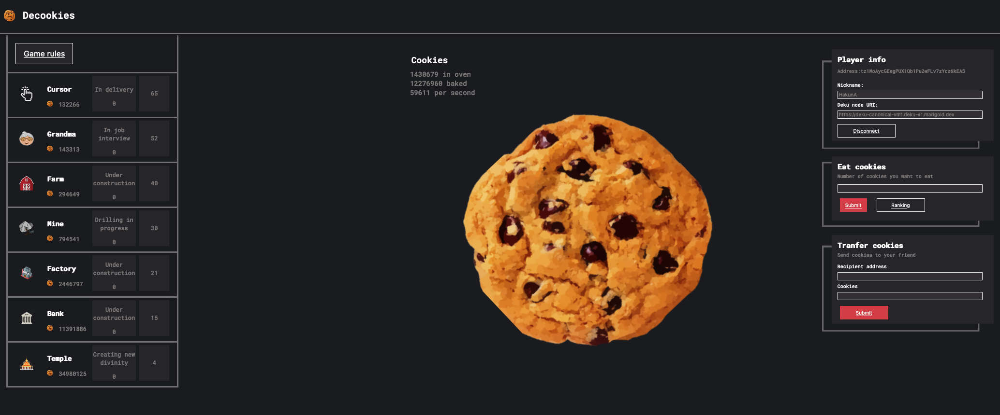

# Decookies

Decookies is a front-end application, allowing players to bakes cookies on [Marigold Sidechain Deku](https://www.marigold.dev/deku).

## Run the game

1. Git clone this repo

2. Run `npm start` and go to `http://localhost:3000` to see the minimalist UI:

3. Fulfill the `Nickname` with your favorite in-game pseudo.

4. Filfill the `Deku node URI` with the URI of your running Deku node

5. Login using [`Beacon wallet`](https://docs.walletbeacon.io/supported-wallets/).

> ** ⚠️ The only thing Decookies will ask you to sign, is the hexadecimal representation of your Nickname ⚠️**

6. Bake cookies!

### Game principles

We basically implemented the same scenario as [cookie-clicker](https://cookieclicker.fandom.com/wiki/Cookie_Clicker_Wiki).

Hence, the levels are almost the same (still in WIP) and the costs calculation is almost the same.

#### Transfer cookies

We added a feature to transfer cookies from your game to an other player. You simply need to fulfill the amount and the recipient address.

#### Eating cookies

What is a cookie baking game if we cannot eat them?

Hence, we added this feature. Let's see who is the biggest eater! A leaderboard will be available to see who has eaten the more cookies! Let's eat yours!

## FAQ

1. Who are Marigold? And what are they working on?

> [Marigold](https://www.marigold.dev/) is a dynamic and collaborative company, established by Gabriel Alfour in November 2020, focused on testing and developing upgrades to the Tezos Protocol.

We have several projects, and one of them is the **Deku sidechain.**

Decookies, is a game running on this Deku sidechain.

2. Why does Decookies ask me to chose and sign my nickname?

To preserve the gameplay, we need to use the [`InMemorySigner` from Taquito](https://tezostaquito.io/docs/inmemory_signer/). This signer needs the Private key and Public address of the user. Of course, we are not going to ask for your private key (because you know you must never share it).

Hence, we use the Beacon SDK to sign your nickname, then use this signed-nickname to generate a `KeyPair` with [human-crypto-keys](https://github.com/ipfs-shipyard/js-human-crypto-keys).

This means: you are the only one able to sign generate the same `KeyPair` because you are the only one able to provide the exact same seed every time.

3. How can I know the public address of my game, to ask cookies from a friend?

As seen previously, the Public address is generated. We are currently working on a proper way to display this information for you.

As you must have seen, the UI is minimalist but working. We are going to enrich it a bit to provide a better experience.
