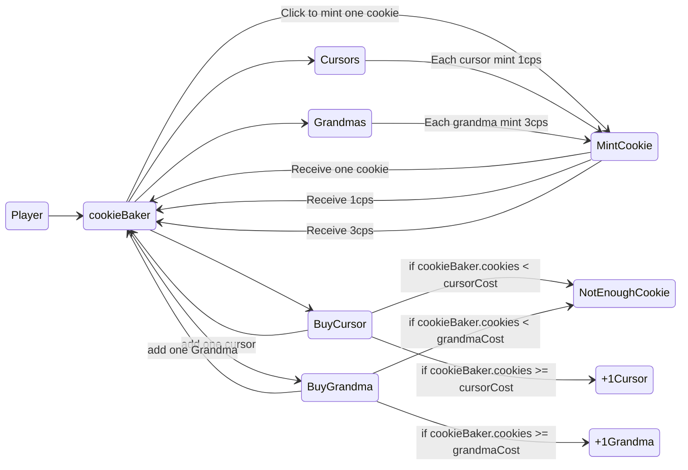
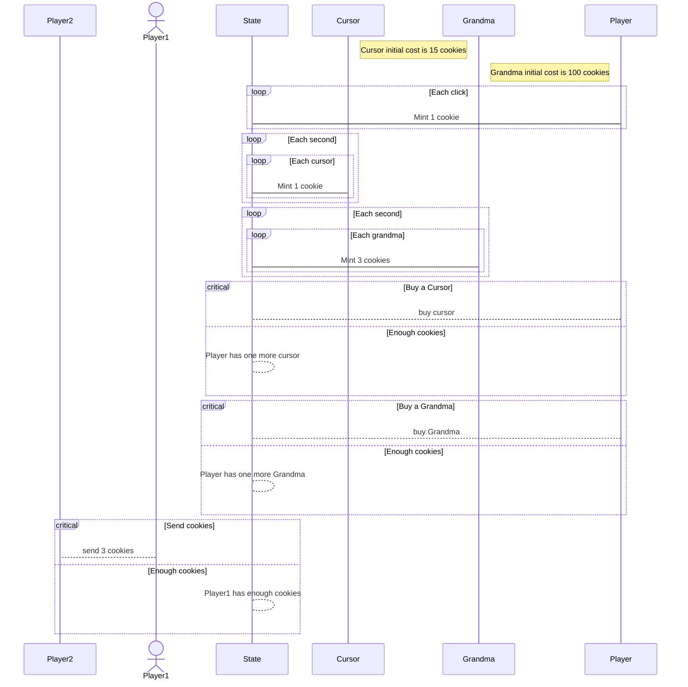

# Decookies

Decookies is a front-end application, allowing players to bakes cookies on [Marigold Sidechain Deku](https://www.marigold.dev/deku).

## Run the game

1. Git clone this repo

2. Run `npm start` and go to `http://localhost:3000` to see the minimalist UI:


3. Filfill the `Deku node URI` with the URI of your running Deku node

4. Login using [`Beacon wallet`](https://docs.walletbeacon.io/supported-wallets/).

> ** ⚠️ The only thing Decookies will ask you to sign, is the "delegation". Under the hood, we generate a random private key to sign all the operations submitted to Deku. ⚠️**

The delegation operation submitted to Deku is:
```ligo
Delegate({onBehalfOf: \"tz1xxx\" as address})
```

Where `tz1xxx` is your Beacon public address. This operation will be submitted to Deku via the randomly generated key, and will allow decookies to bake cookies from the generated address, and link them to your real Beacon address.

Here is an example of the state on Deku side:

```JSON
"state":
    [ "Map",
        [ [ [ "String", "tz1xxxxx" ],
            [ "Pair",
            [ [ "Pair",
                [ [ "Pair",
                    [ [ "Pair",
                        [ [ "Pair",
                            [ [ "Set",
                                [ [ "String",
                                    "tz1Generated1" ],
                                    [ "String",
                                    "tz1Generated2" ],
                                    [ "String",
                                    "tz1Generated3" ],
                                    [ "String",
                                    "tz1Generated4" ],
                                    [ "String",
                                    "tz1Generated5" ] ] ],
                                [ "Int", "60" ] ] ],
                            [ "Pair",
                            [ [ "Int", "0" ], [ "Int", "2232516" ] ] ] ] ],
                        [ "Pair",
                        [ [ "Pair", [ [ "Int", "57" ], [ "Int", "1" ] ] ],
                            [ "Pair",
                            [ [ "Int", "1220491" ], [ "Int", "0" ] ] ] ] ] ] ],
                    [ "Pair",
                    [ [ "Pair",
                        [ [ "Pair",
                            [ [ "Int", "50" ], [ "Int", "172" ] ] ],
                            [ "Pair",
                            [ [ "Int", "1" ], [ "Int", "115" ] ] ] ] ],
                        [ "Pair",
                        [ [ "Pair", [ [ "Int", "1" ], [ "Int", "40" ] ] ],
                            [ "Pair",
                            [ [ "Int", "0" ], [ "Int", "15612" ] ] ] ] ] ] ] ] ],
                [ "Pair", [ [ "Int", "2314" ], [ "Int", "2" ] ] ] ] ] ] ] ]
```

In this case, `tz1xxxxx` is my actual Beacon public address, and `tz1GeneratedX` are every generated keys allowed to bake cookies for me. A new random key is generated each time you disconnect your wallet.

5. Bake cookies!

### Game principles

We basically implemented the same scenario as [cookie-clicker](https://cookieclicker.fandom.com/wiki/Cookie_Clicker_Wiki).

Hence, the levels are almost the same (still in WIP) and the costs calculation is almost the same.

#### Baking cookies

The goal of this game is to bake as many cookies as possible. To do so, there are several ways:

- Click on the cookie button. Each click will submit one cookie to be baked to Deku (cookie in oven). Once the operation had been included in a block, you will have the cookie.
- Buy buildings to passively bake cookies for you. For example, you can buy your first Cursor for 15 cookies. Once the cursor had been baked, it will bake one cookie per second for you.

#### Transfer cookies

We added a feature to transfer cookies from your game to an other player. You simply need to fulfill the amount and the recipient address.

#### Eating cookies

What is a cookie baking game if we cannot eat them?

Hence, we added this feature. Let's see who is the biggest eater! A leaderboard will be available to see who has eaten the more cookies! Let's eat yours!

## FAQ

1. Who are Marigold? And what are they working on?

> [Marigold](https://www.marigold.dev/) is a dynamic and collaborative company, established by Gabriel Alfour in November 2020, focused on testing and developing upgrades to the Tezos Protocol.

We have several projects, and one of them is the **Deku sidechain.**

Decookies, is a game running on this Deku sidechain.

2. What is the cookie-clicker game?

At the genesis of this project, we had two different goals:

- Create a blockchain app to betatest our onboarding on Deku-P
- Test Deku transaction per second

We decided to develop a gam to do them both! We chose to do a cookie-clicker game like (we were mainly inspired by [this one](https://orteil.dashnet.org/cookieclicker/) from Orteil), because it will force us to:

- reach high TPS on Deku side
- develop blockchain app
- develop front to interact with blockchain app

[A first article had been posted on Marigold blog](https://www.marigold.dev/post/30-min-to-create-your-first-blockchain-app-with-typescript-deku) to create your first Blockchain App. Decookies, is a front allowing players to interact with the related Blockchain App, running on Deku Parametric AKA Deku-P.

3. Why does Decookies ask me to chose and sign my nickname?

To preserve the gameplay, we need to use the [`InMemorySigner` from Taquito](https://tezostaquito.io/docs/inmemory_signer/). This signer needs the Private key and Public address of the user. Of course, we are not going to ask for your private key (because you know you must never share it).

Hence, we use the Beacon SDK to sign your nickname, then use this signed-nickname to generate a `KeyPair` with [human-crypto-keys](https://github.com/ipfs-shipyard/js-human-crypto-keys).

This means: you are the only one able to sign generate the same `KeyPair` because you are the only one able to provide the exact same seed every time.

4. How can I know the public address of my game, to ask cookies from a friend?

As explained previously, the Public Address is generated. It is now displayed right below the form you have to complete.

## State machine diagram



> CPS=Cookies Per Second

**TL;DR;**

Each player as a `cookieBaker` type, which stores every counters:

- number of cookies
- number of cursors
- number of grandmas
  There are several possible actions:
- mint a cookie => simply add one cookie in the current amount of cookies
- buy a cursor => if enough cookie to buy one, add one cursor to the current amount of cursors. Every seconds, one cursor will mint one cookie for the user.
- buy a grandma => if enough cookies to buy one, add one grandma to the current amount of grandams. Every secondes, one grandma will mint three cookies for the user.

## Diagram sequence


